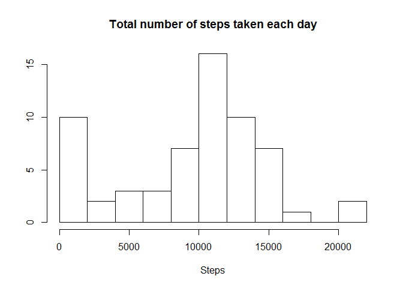
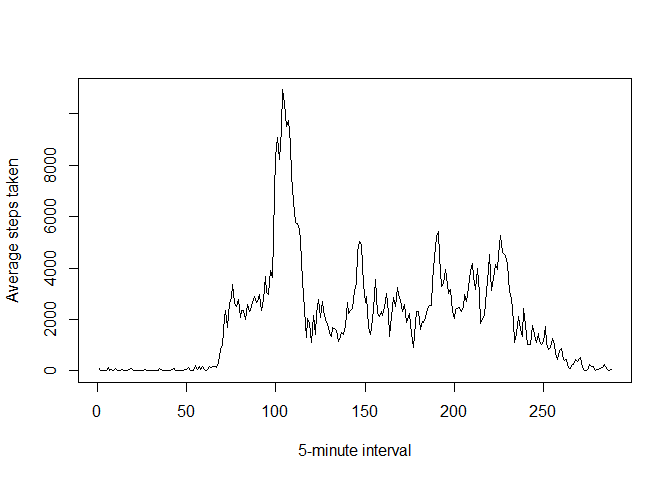
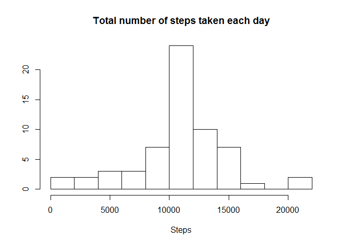
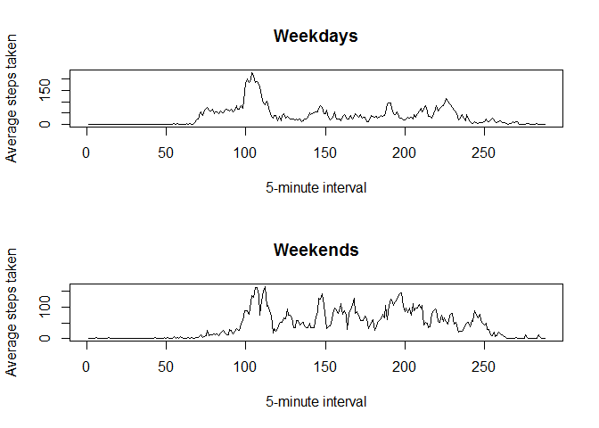

# Reproducible Research: Peer Assessment 1


## Loading and preprocessing the data


```r
data <- read.csv('./activity/activity.csv', colClasses = c('integer', 'Date', 'integer'))
```

## What is mean total number of steps taken per day?


```r
stepsPerDay <- tapply(data$steps, data$date, sum, na.rm=TRUE)
hist(stepsPerDay, breaks=10, main = "Total number of steps taken each day", xlab="Steps", ylab="")
```

 

```r
medianSteps <- median(stepsPerDay)
meanSteps <- mean(stepsPerDay)
```
Mean total number of steps taken per day: **10395**  
Median total number of steps taken per day: **9354.2295082**

## What is the average daily activity pattern?


```r
stepsPerInterval <- tapply(data$steps, data$interval, sum, na.rm=TRUE)
plot(stepsPerInterval, type="l", xlab = "5-minute interval", ylab = "Average steps taken")
```

 

```r
maxStepsPerInterval <- names(stepsPerInterval[match(max(stepsPerInterval), stepsPerInterval)])
```
**835** is a 5-minute interval, which contains the maximum number of steps on average across all the days in the dataset.

## Imputing missing values

```r
numOfIncompleteCases <- length(data$steps) - sum(complete.cases(data$steps))
```
Total number of missing values in the dataset: **2304**

Substituting NAs with means in compliance with the mean amount of steps per interval:

```r
meanStepsPerInterval <- tapply(data$steps, data$interval, mean, na.rm=TRUE)
for(i in 1:nrow(data)) {
    if(is.na(data[i, ]$steps))
        data[i, ]$steps <- as.integer(meanStepsPerInterval[[as.character(data[i, ]$interval)]])
}
stepsPerDay <- tapply(data$steps, data$date, sum)
hist(stepsPerDay, breaks=10, main = "Total number of steps taken each day", xlab="Steps", ylab="")
```

 

```r
medianSteps <- median(stepsPerDay)
meanSteps <- mean(stepsPerDay)
```

Mean total number of steps taken per day after imputing missing values: **10641**  
Median total number of steps taken per day imputing missing values: **10749**
Now mean and meadian are equal and generally higher than they used to be.

## Are there differences in activity patterns between weekdays and weekends?

Creating factor variable for weekdays and weekends:

```r
data <- cbind(data, dayType = rep('weekday', nrow(data)))
levels(data$dayType) <- c(levels(data$dayType), "weekend")
for(i in 1:nrow(data)) {
    if(as.POSIXlt(data[i,]$date)$wday %in% c(6,0)){
        data[i, ]$dayType <- 'weekend'
    }
}
stepsPerIntervalOnWeekdays <- with(subset(data, dayType == 'weekday'), tapply(steps, interval, mean))
stepsPerIntervalOnWeekends <- with(subset(data, dayType == 'weekend'), tapply(steps, interval, mean))
par(mfrow=c(2,1))
plot(stepsPerIntervalOnWeekdays, type="l", xlab = "5-minute interval", ylab = "Average steps taken", main="Weekdays")
plot(stepsPerIntervalOnWeekends, type="l", xlab = "5-minute interval", ylab = "Average steps taken", main="Weekends")
```

 
